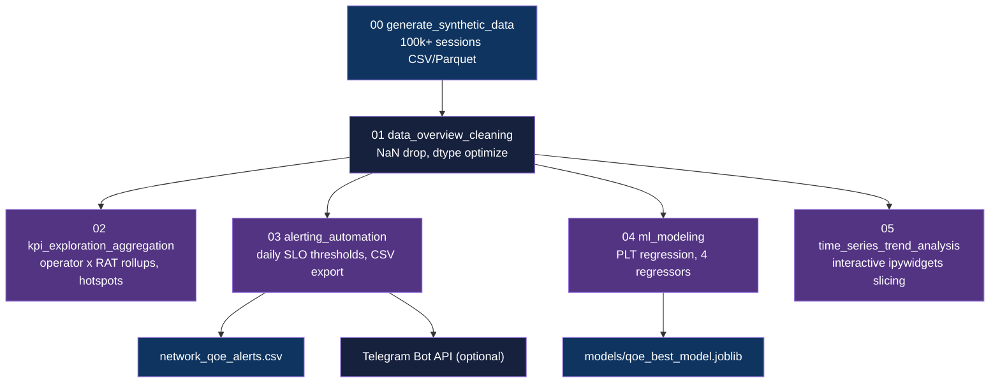

<div align="center">

# Cellular QoE Analytics Demo

[](https://www.python.org/downloads/)
[](https://jupyter.org/)
[](LICENSE)

**Six-notebook demo for application-layer QoE analytics on cellular and Wi-Fi networks**

[Getting Started](#getting-started) | [Usage](#usage) | [Architecture](#architecture)

</div>

---

## Table of Contents

- [Features](#features)
- [Tech Stack](#tech-stack)
- [Architecture](#architecture)
- [Getting Started](#getting-started)
  - [Prerequisites](#prerequisites)
  - [Installation](#installation)
  - [Configuration](#configuration)
- [Usage](#usage)
- [Methodology](#methodology)
- [Results](#results)
- [Data Engineering](#data-engineering)
- [Project Structure](#project-structure)
- [License](#license)
- [Author](#author)

## Features

- **Synthetic session generation** - 100k+ sessions across 4G, 5G, and Wi-Fi with physics-based radio-to-QoE mapping
- **KPI exploration** - operator x RAT rollups with p50/p95/p99 PLT, buffering, and startup delay; hotspot drill-downs by cell/PCI/TAC/band
- **Correlation suite** - radio/observable heatmaps, Pearson, eta, and Cramer's V for categorical associations
- **Threshold alerting** - daily SLO rollup with CSV export; optional Telegram Bot push via `TELEGRAM_BOT_TOKEN`/`TELEGRAM_CHAT_ID`
- **PLT regression** - time-aware 80/20 split, OHE+scaling pipelines, four regressors (Linear, Decision Tree, Random Forest, Gradient Boosting), permutation importance
- **Interactive trend analysis** - ipywidgets dropdowns to slice KPI time series by device, network type, and operator

## Tech Stack

| Component | Technology |
|-----------|------------|
| Language | Python 3.x |
| Notebooks | Jupyter Notebook |
| Data | pandas, numpy, pyarrow, fastparquet |
| Visualization | matplotlib, seaborn |
| ML | scikit-learn |
| Alerting | requests (Telegram Bot API, optional) |
| Environment | Conda (`environment.yml`) |

## Architecture



## Getting Started

### Prerequisites

- [Anaconda](https://www.anaconda.com/products/distribution) or [Miniconda](https://docs.conda.io/en/latest/miniconda.html)
- Optional: Telegram Bot token and chat ID for notebook 03 alerting

### Installation

1. Clone the repository:
   ```bash
   git clone https://github.com/adityonugrohoid/cellular-qoe-analytics-demo.git
   cd cellular-qoe-analytics-demo
   ```

2. Create and activate the conda environment:
   ```bash
   conda env create -f environment.yml
   conda activate qoe-demo
   ```

3. Launch Jupyter:
   ```bash
   jupyter notebook
   ```

### Configuration

Notebook 03 (alerting) reads Telegram credentials from `.env`. Create one if you want live pushes:

```bash
# .env (optional, only needed for Telegram alerting in notebook 03)
TELEGRAM_BOT_TOKEN=your_bot_token_here
TELEGRAM_CHAT_ID=your_chat_id_here
```

Without the `.env` file, the alerting notebook still runs in dry-run mode and writes `network_qoe_alerts.csv` locally.

## Usage

Run the notebooks in order:

```
00_generate_synthetic_data.ipynb      -> synthetic_qoe_sessions.csv
01_data_overview_and_cleaning.ipynb   -> synthetic_qoe_sessions_clean.[parquet|csv]
02_kpi_exploration_and_aggregation.ipynb
03_alerting_and_automation.ipynb      -> network_qoe_alerts.csv
04_ml_modeling.ipynb                  -> models/qoe_page_load_time_ms_best_model.joblib
05_time_series_trend_analysis.ipynb
```

Each notebook is self-contained: it loads the artifact from the previous stage and writes its own outputs to `artefacts/` or `models/`.

## Methodology

### Problem Framing

| Attribute | Value |
|-----------|-------|
| Problem Type | Regression |
| Target Variable | `page_load_time_ms` |
| Primary Metric | RMSE |
| Key Challenge | Temporal leakage from random splitting on session-ordered data |

### Training Approach

| Parameter | Value |
|-----------|-------|
| Algorithms | LinearRegression, DecisionTreeRegressor, RandomForestRegressor (300 trees), GradientBoostingRegressor |
| Numeric Features | `rsrp_dbm`, `rsrq_db`, `sinr_db`, `app_size_kb`, `rtt_ms`, `hour` |
| Categorical Features | `device`, `operator`, `band` (OHE) |
| Validation | Time-aware split: first 80% train, last 20% test (sorted by `timestamp`) |
| Baseline | LinearRegression RMSE |
| Feature Importance | Permutation importance (5 repeats) on test split |

## Results

### Model Performance (time-aware split)

| Model | Primary Metric |
|-------|----------------|
| Linear Regression | RMSE benchmark |
| Decision Tree | RMSE vs. benchmark |
| Random Forest (300 trees) | Best RMSE candidate |
| Gradient Boosting | Best RMSE candidate |

Best model is selected by RMSE and saved to `models/qoe_page_load_time_ms_best_model.joblib`. Metrics vary per synthetic generation seed; run notebook 04 for exact numbers.

### Top Predictors

1. `app_size_kb` - direct driver of page load time
2. `rtt_ms` - round-trip latency propagates into PLT
3. `rsrp_dbm` / `sinr_db` - radio quality feeds into RTT and throughput

## Data Engineering

| Attribute | Value |
|-----------|-------|
| Data Source | Synthetic (generated by `00_generate_synthetic_data.ipynb`) |
| Records | 100,000+ sessions (configurable) |
| Storage | Parquet (primary), CSV (automatic fallback) |
| Features | `timestamp`, `country`, `device`, `network_type`, `operator`, `band`, `channel_number`, `rsrp_dbm`, `rsrq_db`, `sinr_db`, `rtt_ms`, `app_size_kb`, `page_load_time_ms`, `buffering_ratio`, `startup_delay_ms`, `pci`, `tac`, `cell_id`, `session_id` |
| Domain Physics | Smooth radio-to-QoE mapping; device and page-size weighting; reproducible randomness via fixed seed |

## Project Structure

```
cellular-qoe-analytics-demo/
├── 00_generate_synthetic_data.ipynb        # Simulate 100k+ sessions across regions/operators/RATs
├── 01_data_overview_and_cleaning.ipynb     # QC, NaN drop, dtype optimization
├── 02_kpi_exploration_and_aggregation.ipynb# Rollups, hotspots, correlation suite
├── 03_alerting_and_automation.ipynb        # Daily SLO thresholds, CSV export, optional Telegram push
├── 04_ml_modeling.ipynb                    # PLT regression, model comparison, permutation importance
├── 05_time_series_trend_analysis.ipynb     # Interactive KPI trend slicing via ipywidgets
├── environment.yml                         # Conda environment (minimal)
├── environment_full.yml                    # Conda environment (full, with build hashes)
├── conda-win-64.lock                       # Locked dependency set for Windows x64
└── LICENSE
```

## License

This project is licensed under the [MIT License](LICENSE).

## Author

**Adityo Nugroho** ([@adityonugrohoid](https://github.com/adityonugrohoid))
